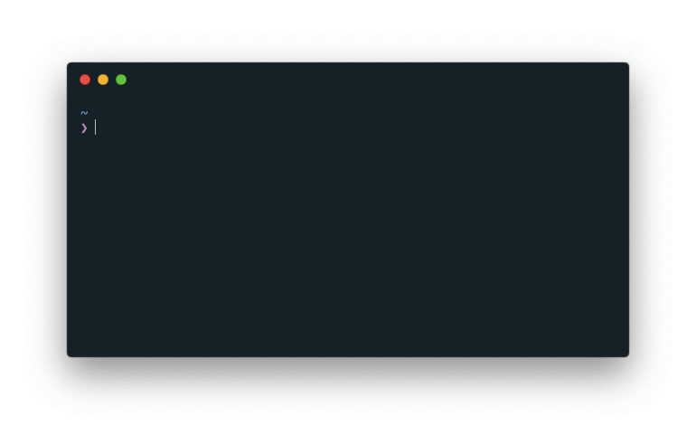

<p align=center>
  
  <br>
  <span>A very simple command line Browser Extension Downloader</span>
  <br>
  
</p>


## Installation
#### Using git
```bash
# clone the repo
$ git clone https://github.com/sdushantha/bed.git

# install the requirements
$ pip3 install --user -r requirements.txt
```

#### Using pip
_Note: I will upload_ `bed` _to pypi soon_
```
pip3 install --user git+https://github.com/sdushantha/bed
```

## Usage
### Supported browsers
- Firefox
- Chrome or any browser that uses the Chrome Web Store
- Opera

```bash
usage: bed [-h] url

A very simple command line Browser Extension Downloader

positional arguments:
  url

optional arguments:
  -h, --help  show this help message and exit
```

[](https://www.buymeacoffee.com/XoJfSVI)
